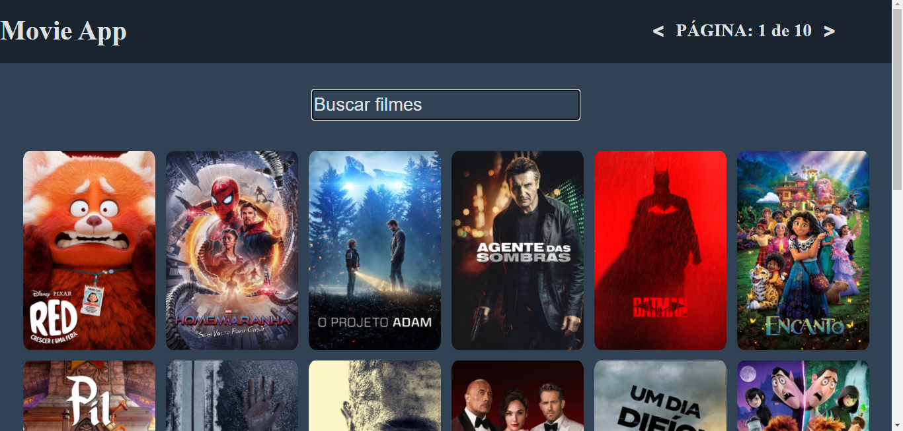
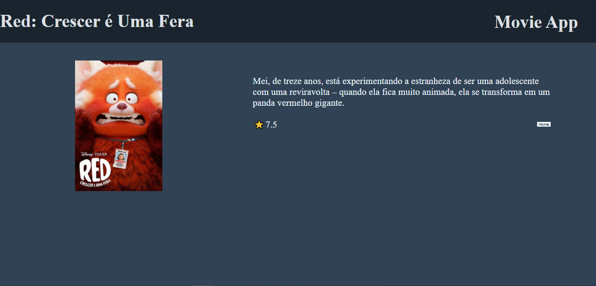

# Movie App

esse projeto é um aplicativo de busca de filmes, ele tem como objetivo mostrar uma lista de filmes inicial com 10 páginas e também um local de busca para encontrar seu filme favorito

## Páginas da aplicação

### Home

 Página inicial do aplicativo com a lista de filmes ordenados pelos meis populares. 🎬

### Página de detalhes

Página onde mostra os detalhes do filme com o título, descrição e nota. 💙

## Tecnologias utilizadas

- HTML
- CSS
- Typescript
- ReactJS

## Para iniciar a aplicação

voce deve primeiro clonar o repositorio e depois realizar os outros comandos em ordem :

### git clone https://github.com/cleytoncaminha/app-movie.git

### cd app-movie

### npm install

### npm start

## Links do projeto
<a href="https://app-movie-orpin.vercel.app/">Página do projeto</a>
<a href="https://github.com/cleytoncaminha/app-movie.git">Github do projeto</a>
